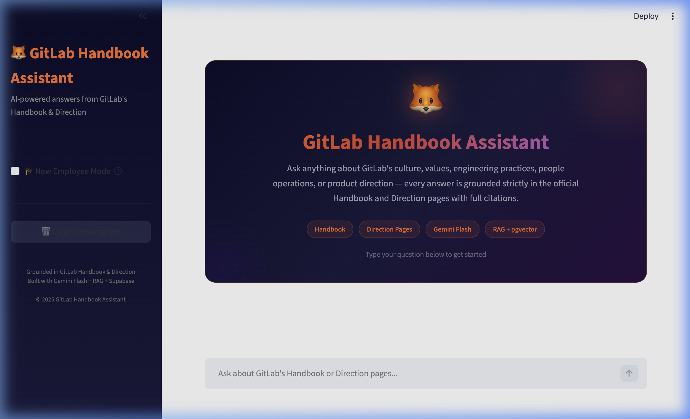
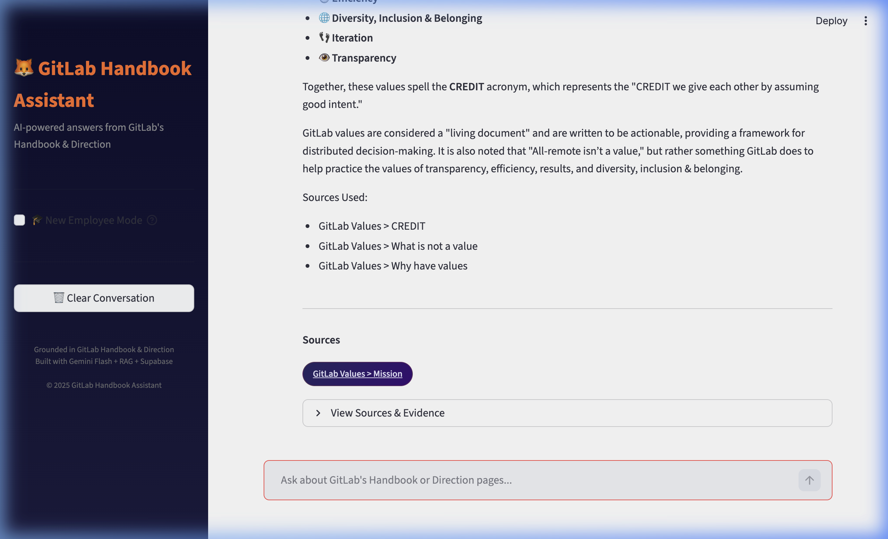
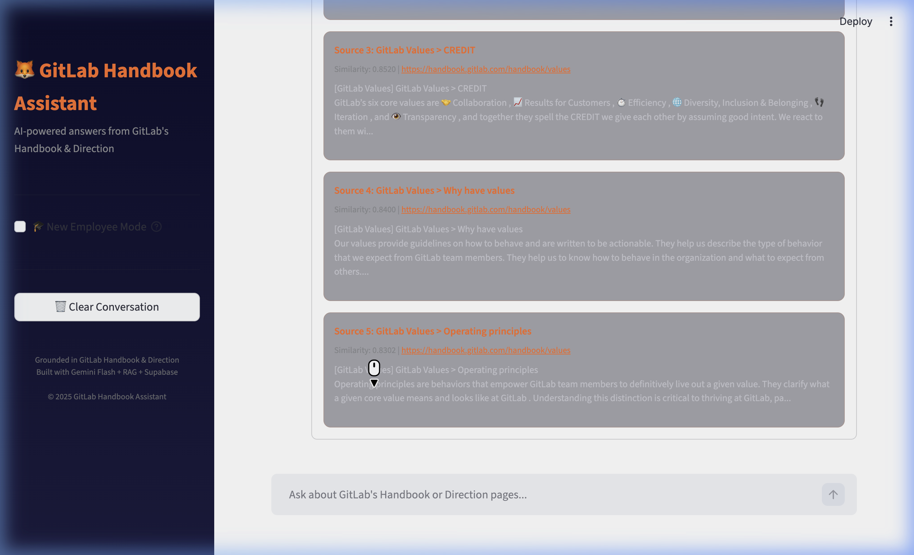
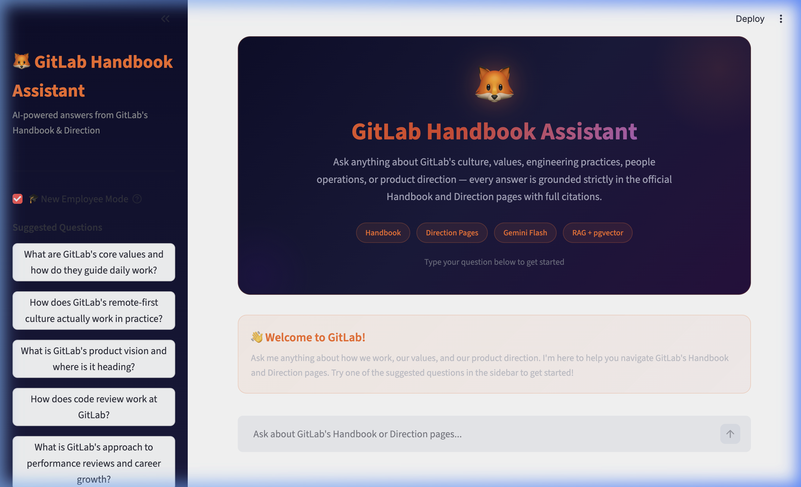

# GitLab Handbook Assistant

> An AI-powered RAG chatbot that answers questions about GitLab's public [Handbook](https://handbook.gitlab.com/) and [Direction](https://about.gitlab.com/direction/) pages — grounded strictly in those sources, with full citations and transparency.

**Live demo:** [joveo-assignment.streamlit.app](http://joveo-assignment.streamlit.app/)

---

## Architecture

```
┌─────────────────────────────────────────────────────────────────────┐
│                        DATA PIPELINE (One-Time)                     │
│                                                                     │
│   ┌──────────┐    ┌──────────┐    ┌──────────┐    ┌─────────────┐  │
│   │  Scraper  │───▶│  Chunker │───▶│ Embedder │───▶│  Supabase   │  │
│   │ (BS4 +   │    │(LangChain│    │ (Local    │    │ (pgvector)  │  │
│   │ requests)│    │ RCTS)    │    │  BGE)     │    │             │  │
│   └──────────┘    └──────────┘    └──────────┘    └─────────────┘  │
└─────────────────────────────────────────────────────────────────────┘

┌─────────────────────────────────────────────────────────────────────┐
│                     QUERY PIPELINE (Real-Time)                      │
│                                                                     │
│   ┌──────────┐    ┌──────────┐    ┌──────────┐    ┌─────────────┐  │
│   │  User    │───▶│Guardrail │───▶│  Router  │───▶│  Retriever  │  │
│   │  Query   │    │(On-Topic │    │(Category │    │(Supabase    │  │
│   │          │    │ Check)   │    │ Classify)│    │ pgvector)   │  │
│   └──────────┘    └──────────┘    └──────────┘    └──────┬──────┘  │
│                                                          │         │
│                   ┌──────────┐    ┌──────────┐    ┌──────▼──────┐  │
│                   │Streamlit │◀───│ Sources  │◀───│  Gemini     │  │
│                   │   UI     │    │& Evidence│    │  Flash      │  │
│                   └──────────┘    └──────────┘    └─────────────┘  │
└─────────────────────────────────────────────────────────────────────┘
```

### Pipeline Flow

1. **Scraper** → Crawls GitLab Handbook (≤300 pages) and Direction sub-pages using `requests` + `BeautifulSoup4`. Saves structured JSON with heading hierarchy preserved.
2. **Chunker** → Splits scraped text by sections using LangChain's `RecursiveCharacterTextSplitter` (~600 tokens, 100 overlap). Prepends H1/H2/H3 context to each chunk.
3. **Embedder** → Embeds all chunks locally in batches using Sentence-Transformers `BAAI/bge-base-en-v1.5` (768 dimensions), avoiding Gemini embedding quota limits.
4. **Supabase** → Stores chunks with embeddings in a `pgvector`-enabled table. Uses HNSW indexing for fast cosine similarity search. SHA-256 hash deduplication.
5. **Guardrail** → Lightweight keyword classifier rejects off-topic queries before RAG runs. Displays a graceful, actionable boundary message.
6. **Router** → Classifies queries into categories (engineering, people_ops, product_direction, values_culture, general) and boosts retrieval from matching sources.
7. **Retriever** → Embeds the query, calls `match_chunks` RPC in Supabase, returns top-5 chunks with similarity scores.
8. **Generator** → Builds a grounded prompt with retrieved context + conversation history, calls Gemini Flash with strict grounding rules.
9. **Streamlit UI** → Renders a hero landing section, answers with confidence indicators, clickable source citations, collapsible evidence panels, and onboarding mode.

---

## Features

| Feature | Description |
|---------|-------------|
| **Hero Landing Section** | Full-width branded hero shown before first message — animated fox, gradient title, capability badges |
| **Core RAG Pipeline** | Scrape → Chunk → Embed → Store → Retrieve → Generate with full source grounding |
| **Source Citations** | Every answer includes clickable source links with section titles |
| **On-Topic Guardrailing** | Keyword classifier rejects off-topic queries with a clear, graceful redirect message |
| **Graceful Error Handling** | Specific messages for rate limits, connection errors, config errors, and transient failures |
| **Evidence Panel** | Collapsible panel showing raw chunks, similarity scores, and source URLs for verification |
| **Confidence Gating** | Amber indicator + notice when top similarity score < 0.75; prevents over-confident answers on weak matches |
| **Section-Aware Routing** | Query classification boosts retrieval from relevant sources (handbook vs. direction) |
| **Onboarding Mode** | Sidebar toggle with 8 curated starter questions for new GitLab employees |
| **Conversation Memory** | Last 3 turns of conversation context passed to Gemini for natural follow-ups |
| **Clean UI** | Minimal emoji usage — only functional avatars retained; all decorative clutter removed |
| **Multi-Key Rotation** | Round-robin pool of up to 10 Gemini API keys with 429-triggered backoff and auto-scaling quotas |
| **Meta Query Handler** | Chatbot identity and GitLab company questions answered instantly without burning an API call |

---

## Screenshots

### Hero — Landing State


### Chat Answer with Sources


### Evidence Panel (Expanded)


### New Employee Onboarding Mode


---

## Project Structure

```
gitlab-chatbot/
├── .streamlit/
│   └── secrets.toml          # Streamlit secrets (local dev + Cloud template)
├── scraper/
│   ├── __init__.py
│   └── scrape.py              # Full scraper for Handbook + Direction
├── pipeline/
│   ├── __init__.py
│   ├── chunk.py               # LangChain chunking logic
│   ├── embed.py               # Local sentence-transformers embedding
│   └── ingest.py              # Orchestrator: scrape → chunk → embed → upsert
├── rag/
│   ├── __init__.py
│   ├── retriever.py           # Supabase vector search
│   ├── guardrail.py           # On-topic classifier + graceful response messages
│   ├── router.py              # Section-aware query router
│   ├── topic_rules.py         # Keyword-based topic & category rules (incl. meta)
│   ├── key_pool.py            # Thread-safe round-robin Gemini API key pool
│   └── chain.py               # Full RAG chain orchestration
├── docs/
│   └── screenshots/           # App screenshots for README
├── app.py                     # Streamlit UI (main entry point)
├── gemini_limits.py           # Rate-limit token bucket (auto-scales with key count)
├── supabase_setup.sql         # Database setup script
├── requirements.txt           # Python dependencies
├── .env.example               # Environment variable template
├── .gitignore                 # Git ignore rules
└── README.md                  # This file
```

---

## Technical Details

### Scraping Strategy
- BFS crawl sorted by URL depth (shallower = higher priority)
- Handbook capped at 300 pages; Direction crawls all `/direction/` sub-pages
- 1-second polite delay between requests
- Skips PDFs, images, external links, and anchor-only links
- Preserves heading hierarchy (H1 → H2 → H3) per section

### Chunking Strategy
- LangChain `RecursiveCharacterTextSplitter` with ~600 token chunks and 100 token overlap
- Each chunk is prefixed with its heading context (`[Page Title] Section > Subsection`)
- Separators: `\n\n` → `\n` → `. ` → ` ` → `""`

### Embedding & Storage
- Local `BAAI/bge-base-en-v1.5` embeddings (768 dimensions)
- Batched locally with configurable batch size and retry
- HNSW index on Supabase for sub-second similarity search
- SHA-256 chunk hash deduplication prevents re-insertion

### RAG Pipeline
- Guardrail: keyword-based topic check (ON_TOPIC / OFF_TOPIC) — no LLM call needed
- Router: category classification with source_type boosting
- Retrieval: cosine similarity via Supabase RPC, top-5 chunks
- Generation: Gemini Flash with strict grounding rules and temperature 0.3
- Confidence gate: top similarity < 0.75 triggers low-confidence notice

---

## Development History & Iteration Log

This section documents the major technical decisions, failed approaches, and the working alternatives that replaced them — serving as a reference for future contributors.

### Version 0.1 — Initial Prototype (Gemini Embeddings)

| Aspect | Detail |
|--------|--------|
| **Embedding approach** | `google-generativeai` SDK (`embed_content`) with `models/embedding-001` |
| **Why it failed** | Free-tier Gemini embedding quota: 1,500 RPD total, ~100 RPM. At ~50,000+ chunks the pipeline would have taken days and hit hard quota walls. |
| **Symptom** | `429 ResourceExhausted` after the first few hundred chunks; no retry path feasible at scale |
| **Decision** | Abandon Gemini embeddings entirely for ingestion |

### Version 0.2 — Local BGE Embeddings (sentence-transformers)

| Aspect | Detail |
|--------|--------|
| **Embedding approach** | `BAAI/bge-base-en-v1.5` via `sentence-transformers`, run fully locally |
| **Why it worked** | Zero API cost, no rate limits, 768-dim vectors match Supabase pgvector well |
| **Trade-off** | ~5 min local compute for full ingestion (acceptable for a one-time operation) |
| **Status** | **Current approach — production** |

### Version 0.3 — SDK Migration: google-generativeai → google-genai

| Aspect | Detail |
|--------|--------|
| **Problem** | `google-generativeai` (old SDK) deprecated `GenerationConfig` and changed module paths in v0.8+ |
| **Symptom** | `ImportError: cannot import name 'GenerationConfig'`; API calls returned 400s with model name mismatches |
| **Fix** | Migrated entirely to `google-genai` v1 SDK (`from google import genai`). Updated all API calls to use `genai.Client`, `genai_types.GenerateContentConfig`, and `api_version="v1beta"` |
| **Status** | **Current approach — production** |

### Version 0.4 — Rate Limiting: Tenacity + Custom Token Bucket

| Aspect | Detail |
|--------|--------|
| **Problem** | Free-tier Gemini Flash limits: 5 RPM, 250k TPM, 20 RPD. Bursting even 2–3 parallel requests caused 429s |
| **Failed approach** | Simple `time.sleep()` delays — too coarse; didn't account for token budgets |
| **Fix** | Built `gemini_limits.py`: a persistent token bucket with per-operation `acquire()` that tracks both RPM and TPD. Wrapped generation calls with `@retry(stop_after_attempt(3), wait=wait_exponential(...))` via `tenacity` |
| **Status** | **Current approach — production** |

### Version 0.5 — Vector Store: FAISS → Supabase pgvector

| Aspect | Detail |
|--------|--------|
| **Original plan** | FAISS for local vector storage (no external dependency) |
| **Why it failed** | FAISS has no native persistence format compatible with Streamlit Cloud's ephemeral filesystem; rebuilding the index on every cold start would require running the full embedding pipeline at runtime — infeasible |
| **Fix** | Moved to Supabase (free tier) with `pgvector` extension. SHA-256 deduplication ensures idempotent re-ingestion. HNSW index (`lists=100`, `probes=10`) gives sub-100ms retrieval |
| **Status** | **Current approach — production** |

### Version 0.6 — Guardrail: LLM Classifier → Keyword Rules

| Aspect | Detail |
|--------|--------|
| **Original approach** | Call Gemini at `temperature=0` to classify ON_TOPIC / OFF_TOPIC before every query |
| **Problem** | Every guardrail check consumed one of the 20 RPD free-tier calls; on a 20-question session that's the entire daily budget gone before generation |
| **Fix** | Replaced with a deterministic keyword-scoring system in `topic_rules.py`. No LLM call needed for classification. Categories and off-topic detection handled by regex-normalized keyword matching |
| **Status** | **Current approach — production** |

### Version 0.7 — Frontend Polish & UX Improvements

| Aspect | Detail |
|--------|--------|
| **Hero section** | Added a full-width hero with animated fox, gradient title, and capability badges — shown only on empty state |
| **Emoji audit** | Removed all decorative emojis from user-visible UI strings; retained only functional avatars (🦊, 👤) and the onboarding/clear-chat icons |
| **Error messages** | Replaced generic catch-all error strings with specific messages for: rate limits (429), connection failures, config errors, and transient failures |
| **Low-confidence UX** | Separated the "low confidence" prefix from the answer text; now rendered as a styled notice card below the answer |
| **Off-topic UX** | Off-topic and error responses now render in styled HTML cards (`.offtopic-card`, `.error-card`) with clear, non-alarming copy |
| **guardrail.py bug fix** | `OFF_TOPIC_RESPONSE` was referenced but never defined — fixed by defining it in `guardrail.py` with proper HTML-formatted copy |
| **Status** | **Current approach — production** |

### Version 0.8 — Multi-Key Gemini API Rotation

| Aspect | Detail |
|--------|--------|
| **Problem** | Free-tier Gemini Flash limit is 20 RPD per key — exhausted quickly in demo/evaluation scenarios |
| **Solution** | Implemented `rag/key_pool.py`: a thread-safe `GeminiKeyPool` with round-robin rotation across up to 10 keys |
| **Self-healing** | On a `429 ResourceExhausted`, the pool marks that key with a 62-second backoff and immediately rotates to the next available key; the tenacity retry then succeeds with a fresh quota |
| **Auto-scaling quotas** | `gemini_limits.py` detects the key count at startup and multiplies all RPD/RPM ceilings (e.g. 3 keys → 60 RPD, 15 RPM) |
| **Secrets format** | Keys are loaded from `GOOGLE_API_KEY_1` … `GOOGLE_API_KEY_10` in Streamlit secrets or environment variables |
| **Status** | **Current approach — production** |

### Version 0.9 — Meta Query Handler & Enriched System Prompt

| Aspect | Detail |
|--------|--------|
| **Problem** | Questions like "Who are you?", "What is GitLab?", "Where is GitLab located?" were either rejected by the guardrail or returned poor RAG answers with low-relevance chunks |
| **Solution** | Added `META_KEYWORDS` set in `topic_rules.py`; meta queries short-circuit the RAG pipeline entirely in `chain.py` and return a rich hardcoded response with links — no API call consumed |
| **System prompt** | Enriched `SYSTEM_PROMPT` with verified GitLab company facts (founding year, HQ, CEO, IPO, mission, user count) so the LLM can also handle factual questions within the regular pipeline |
| **Guardrail update** | Meta queries are now always classified as on-topic (`is_on_topic → True`) and routed to the new `"meta"` / `"About"` category |
| **Status** | **Current approach — production** |

---
## Setup Instructions - if you want to run this locally and deploy for yourself

### Prerequisites

- Python 3.10+
- A [Google AI Studio](https://aistudio.google.com/) API key (needed for answer generation with Gemini Flash)
- A [Supabase](https://supabase.com/) project (free tier available)

### Step 1: Clone the Repository

```bash
git clone https://github.com/your-username/gitlab-chatbot.git
cd gitlab-chatbot
```

### Step 2: Install Dependencies

```bash
python -m venv venv
source venv/bin/activate  # On Windows: venv\Scripts\activate
pip install -r requirements.txt
```

### Step 3: Set Up Supabase

1. Create a new Supabase project at [supabase.com](https://supabase.com/)
2. Go to **SQL Editor** in your Supabase dashboard
3. Copy the contents of `supabase_setup.sql` and run it
4. This creates the `gitlab_chunks` table, HNSW index, and `match_chunks` function

### Step 4: Set Environment Variables

**For local development:**

```bash
cp .env.example .env
# Edit .env with your actual values:
# GOOGLE_API_KEY=your_key_here
# SUPABASE_URL=https://your-project.supabase.co
# SUPABASE_KEY=your_anon_key_here
```

Also update `.streamlit/secrets.toml` for local Streamlit development.

### Step 5: Run the Scraper (One-Time)

```bash
python scraper/scrape.py
```

This crawls GitLab's Handbook (up to 300 pages) and Direction pages, saving structured data to `scraped_data.json`. Takes ~10–15 minutes depending on your connection.

### Step 6: Run the Ingestion Pipeline (One-Time)

```bash
python pipeline/ingest.py
```

This reads `scraped_data.json`, chunks the content, embeds each chunk locally, and upserts everything to Supabase. Takes ~5–10 minutes.

### Step 7: Run the App

```bash
streamlit run app.py
```

The app will open at `http://localhost:8501`.

---

## Deploy to Streamlit Community Cloud

1. Push your code to a GitHub repository (ensure `scraped_data.json` and `venv/` are in `.gitignore`)
2. Go to [share.streamlit.io](https://share.streamlit.io/)
3. Click **"New app"** and select your repository
4. Set the main file path to `app.py`
5. Go to **"Advanced settings" → "Secrets"** and paste your keys in TOML format.

**Single key (minimum):**
```toml
GOOGLE_API_KEY_1 = "your_actual_google_api_key"
SUPABASE_URL     = "https://your-project.supabase.co"
SUPABASE_KEY     = "your_anon_key_here"
```

**Multiple keys (recommended — scales quota linearly):**
```toml
GOOGLE_API_KEY_1 = "AIza..."
GOOGLE_API_KEY_2 = "AIza..."
GOOGLE_API_KEY_3 = "AIza..."
SUPABASE_URL     = "https://your-project.supabase.co"
SUPABASE_KEY     = "your_anon_key_here"
```

> **Multi-key rotation:** The app auto-discovers `GOOGLE_API_KEY_1` through `GOOGLE_API_KEY_10`. Each additional key adds 20 RPD and 5 RPM to the effective quota (3 keys = 60 RPD). On a 429 rate-limit error, the system marks the current key with a 62-second backoff and transparently rotates to the next available key.

> **Why numbered keys instead of `GOOGLE_API_KEY`?** The numbered scheme allows the app to build a key pool at startup without any code changes. Add more keys to `secrets.toml` and the quota scales automatically.

6. Click **"Deploy"**

> **Note:** Make sure the ingestion pipeline has already been run and data exists in your Supabase database before deploying. The scraper and ingestion scripts do not run on Streamlit Cloud.

---

## License

This project is for educational and evaluation purposes. GitLab's Handbook and Direction content is publicly available under their respective licenses.

---

Built with Gemini Flash + RAG + Streamlit + Supabase
